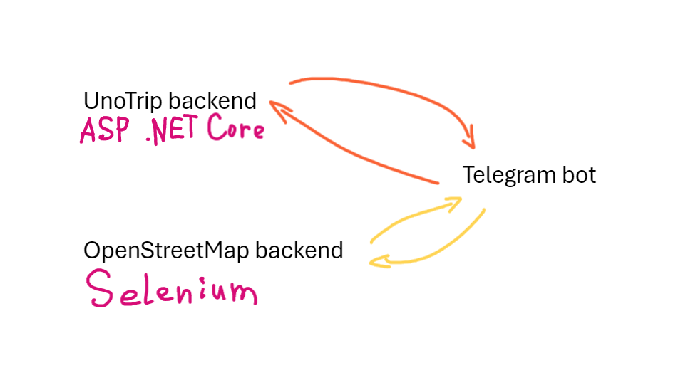
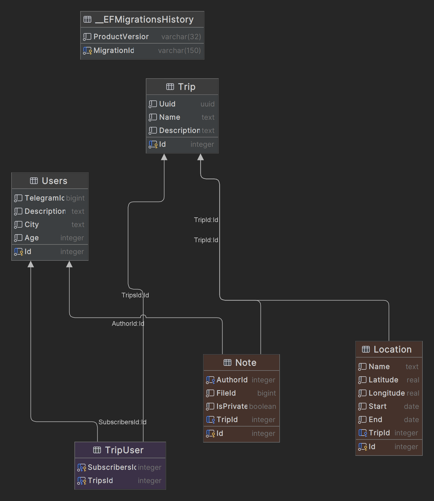

# UnoTrip

UnoTrip - это бот для организации путешествий с друзьями.
Ссылка на бота: https://t.me/uno_trip_bot

## Описание

Приложение UnoTrip предназначено для удобной организации путешествий с друзьями. Оно позволяет создавать планы поездок, делиться ими с друзьями, находить интересные места в путешествии и многое другое.

## Темы

1. Запуск
2. Что делать, если что-то не работает?
3. Почему были выбраны именно эти технологии?
4. Использование
5. Описание внешних интеграций
6. Схема данных СУБД
7. Контакты


## Запуск

Для запуска выполните следующее:

1. Запустите Docker-Compose:
```
docker compose up -d
```

# Что делать, если что-то не работает?
1. Запуск бота довольно тривиален:
   ```
   python main.py
   ```
3. Запуск бекенда тоже:
   ```
   dotnet run -c Release
   ```
4. Возможно, не проходят именно миграции и обновления БД, в таком случае в Dockerfile в /solution/, показаны команды, которые нужны для выполнения этих действий

Из чего состоит Docker-Compose:
1. Telegram-бот на Aiogram
2. Web API на C# (ASP .NET Core 8)
3. PostgreSQL база данных
4. Redis

# Почему были выбраны именно эти технологии?
Я предпочел писать бекенд на C#, потому что хорошо знаю этот язык и мне проще всего поддерживать на нем чистую архитектуру приложения. Конкретно в этом проекте, я реализовал Domain Driven Design концепцию, а также применил паттерн проектирования CQRS. Я выбрал Aiogram, потому что это самая популярная библиотека для создания ботов, а также потому что на ней существуей уйма документации. PostgreSQL я выбрал потому что часто использовал эту БД и до этого, а Redis нужен для сохранения пользовательских диалогов в кеше, чтобы при каком-либо краше бота, все пользовательские диалоги все-таки остались. Для создания маршрутов я использовал Graphhopper API, а для рендеринга я поднял свое API на VPS, которое использует Selenium для отрисовки маршрутов.

## Использование

После запуска вы сможете:

- Создавать планы поездок.
- Добавлять друзей в свои поездки.
- Делиться планами с друзьями.
- Находить интересные места в путешествии.
- и многое другое!

Видео с демонстрацией: []

## Описание внешних интеграций
Для отрисовки, как я сказал ранее, я использую собственное API на Selenium, потому что оно позволяет наиболее полно контролировать процесс отрисовки. Для прогноза погоды я использую сервис OpenMeteo, потому что это Open Source проект, а также потому что их API довольно удобен. Для рекомендаций различных мест я использую сервис FourSquares. Он предоставляет удобный функционал, который широко раскрывается в боте. В бекенде используется PostgreSQL, как я говорил ранее, я довольно часто работал с ней, поэтому этот проект не стал исключением. В качестве ORM я использую Entity Framework Core



## Схема данных СУБД
Таблица User - представляет пользователей
Таблица Trip - представляет путешествия
Таблица TripUser - представляет связь Many-to-Many между пользователями и путешествиями
Таблица Note - представляет запись, при этом она привязана к пользователю (через AuthorId) и путешествию (TripId)
Таблица Location - представляет локацию, она привязана к какому-то путешествию (через TripId)



## Контакты

Если у вас возникли вопросы, то напишите мне, пожалуйста, в Telegram: @has_no_enemies. У моего бота реально много функционала, но я мог зафейлить настройку Docker'а
 
